Security tools, defensive labs, and technical write-ups built for practical learning.

## Featured projects

| Project | Problem solved | Language | Validation |
| --- | --- | --- | --- |
| [GHOSTTAG](https://github.com/delriscotechnologies/ghosttag) | Inspects JPEG and PNG metadata without modifying or uploading the image | Go | [CI workflow](https://github.com/delriscotechnologies/ghosttag/actions/workflows/ci.yml) |
| [TRAP21](https://github.com/delriscotechnologies/trap21) | Presents a bounded FTP decoy and records structured honeypot evidence | Java, Docker | [CI workflow](https://github.com/delriscotechnologies/trap21/actions/workflows/ci.yml) and [security workflow](https://github.com/delriscotechnologies/trap21/actions/workflows/security.yml) |
| [PhishFry](https://github.com/delriscotechnologies/phishfry) | Extracts local evidence from EML files without opening URLs or attachments | PowerShell | Manual validation; no CI workflow |
| [Arpticuno](https://github.com/delriscotechnologies/arpticuno) | Performs bounded IPv4 LAN discovery and TCP connect scanning | Python | Pytest suite included; no CI workflow |

## Labs and write-ups

- [HomeLabSOC](https://github.com/delriscotechnologies/homelabsoc) — distributed SOC architecture and lessons learned
- [Active Directory Home Lab](https://github.com/delriscotechnologies/homelabactivedirectory) — identity, telemetry, Splunk, and controlled attack simulation
- [HoneypotSSH](https://github.com/delriscotechnologies/honeypotssh) — Cowrie and Hydra training lab
- [DNS Blocker](https://github.com/delriscotechnologies/dns-blocker) — network-wide Pi-hole and OpenDNS filtering

All offensive or monitoring techniques are intended only for systems and networks you own or are explicitly authorized to test.
